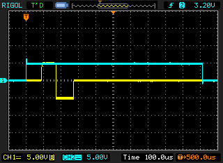
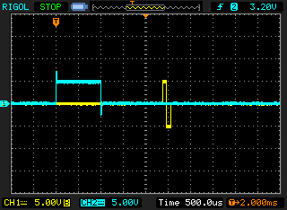
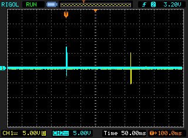
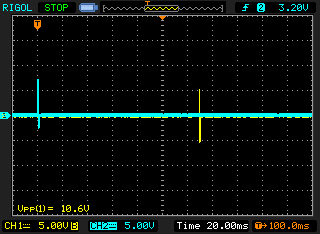

Benchmark
---------

There are several possible ways how you can start stimulation on the STG. Depending on how you do that, different jitters and latencies apply.

All the following examples use our in-house Arduino interface to generate TTL of 1ms duration. This trigger signal is shown in the oscilloscope figures as blue trace. Above each figure, you can see the code which caused this behaviour, and each code required the following snippet for initialiazation.

.. code-block:: python

   from stg.api import STG4000Streamer
   from arduino.onebnc import Arduino
   import time

   stg = STG4000Streamer()
   print(stg, stg.version)
   a = Arduino()
   print(a.enquire())
   
Trigger via TTL
***************

The fastest and most reliable by far is triggering via TTL when a stimulation has already been downloaded with :meth:`~stg._wrapper.downloadnet.STG4000.download`. In that regard, the latency from the TTL arriving at the STGs BNC to the actual stimulation occuring is aroung 65µs.

.. code-block:: python

   stg.download(0,[1,-1, 0], [0.1, 0.1, 49.8])
   while True:
   	time.sleep(0.5)    
	a.trigger()

  
  
Trigger via USB
***************

Compared to the fastest possible, triggering via :meth:`~.STG4000.start_stimulation` is still quite good. It comes with a latency of 1 to 1.5 ms.

.. code-block:: python

	stg.download(0,[1,-1, 0], [0.1, 0.1, 49.8])
	while True:
		time.sleep(0.5)    
		a.trigger()
		stg.start_stimulation([0])

  
  
Download on the fly
*******************

If we want to adapt the stimulation signal on the fly, we have to download it before starting it. Downloading takes a long time, and latency and jitter are drastically increased to around 200 to 250ms. 

Additionally, although not shown here, any ongoing stimulation at this channel will be interrupted while the download is going on. This means adaptation of e.g. the amplitude of an ongoing repetitive stimulation is not possible, if that stimulation is at a frequency faster than 4 Hz.

.. code-block:: python

	while True:
		time.sleep(0.5)
		a.trigger()
		stg.download(0,[1,-1, 0], [0.1, 0.1, 49.8])    
		stg.start_stimulation([0])   

  

Stream
******

Only in these cases, it makes sense to consider the streaming interface offered by :meth:`~stg._wrapper.streamingnet.STG4000Streamer.start_streaming`. It incurs a hefty testing cost and requires careful tuning if the buffer sizes, due to the non-preventable racing conditions involving multiple buffers. Yet, at around 125ms, the latency can be better than when downloading on the fly. Additonally it allows adaptation of ongoing stimulation at a frequency faster than 4 Hz.

.. code-block:: python

	buffer_in_s=0.05
	callback_percent=10
	capacity_in_s=.1
	stg.start_streaming(capacity_in_s=capacity_in_s, 
		                buffer_in_s=buffer_in_s,
		                callback_percent=callback_percent)
	while True:
		stg.set_signal(0, amplitudes_in_mA=[0], durations_in_ms=[.1])
		time.sleep(0.5)    
		a.trigger()
		stg.set_signal(0, amplitudes_in_mA=[1, -1, 0], durations_in_ms=[.1, .1, 49.7])
		time.sleep(buffer_in_s * callback_percent/100)   

